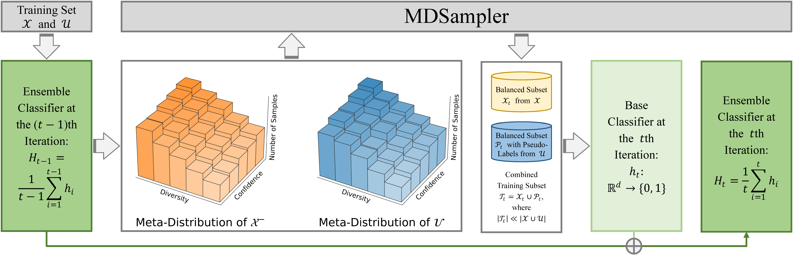

# MDSampler

## Overview

Code for manuscript `MDSampler: Meta-Distribution-Based Ensemble Sampler for Imbalanced Semi-Supervised Learning`. MDSampler is a unified framework that integrates SSL, imbalanced learning, and ensemble learning via iterative instance under-sampling and cascade classifier aggregation. Specifically, MDSampler considers the confidence-diversity distribution of both labeled and unlabeled samples and obtains the so-called meta-distribution via 2-D histogram discretization. Sampling on the meta-distribution 1) assigns pseudo-labels to unlabeled data for SSL, 2) alleviates class imbalance since the sampling process is unbiased, 3) improves the diversity of the ensemble learning framework, and 4) is highly efficient and flexible. Additionally, an adaptive instance interpolation strategy is presented to further improve the quality of pseudo-labeled samples.

**Figure 1.** Overview of the proposed MDSampler framework.

## Usage

* Required Python 3 packages:
    1. `numpy==1.21.5`;
    2. `sklearn` (https://github.com/scikit-learn/scikit-learn);

* MDSampler is compatible with most sklearn APIs but is not strictly tested.

* Import: `from MDSampler import MDSampler`.

* Train: `fit(X, y)`, with target $y_i \in (-1, 0, 1)^l$ as the labels: $y= -1$ denotes the unlabeled sample, $y = 0$ denotes the majority sample, and $y = 1$ denotes the minority sample.

* Predict: `predict(X)` (hard prediction), `predict_proba(X)` (probalistic prediction).

* Parameters: 
    1. `base_estimator`: Classifier object with `predict_proba()` function;
    2. `feature_ranker`: Feature selection (ranking) object that gives weights to features in $\mathcal{X}$;
    3. `k_sup`: The number of warm-up training iterations;
    4. `k_semi`: The number of semi-supervised learning iterations;
    5. `w`: Controls the number of bins in MDSampler (i.e., $w^2$ bins in total);
    6. `adaptive_instance_interpolation`: When True, the adaptive instance interpolation module is employed.

## Visualization

**Figure 2.** Decision boundaries and classification performance (AUPRC) of tested algorithms on the imbalanced Two Moons datasets with different levels of Gaussian noises. Blue dots, orange dots, and white dots denote labeled majority samples, labeled minority samples, and unlabeled minority samples, while unlabeled majority samples are not plotted for clarity. MDSampler consistently obtains more favorable decision boundaries and better classification performance. On the other hand, Self-Training, Co-Training, etc,  may fail (perform inferior to the Supervised Only case) on the imbalanced Two Moons datasets.
